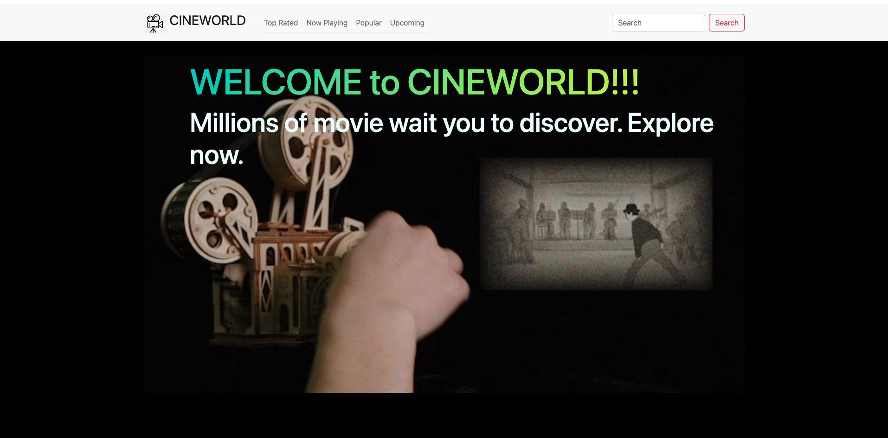
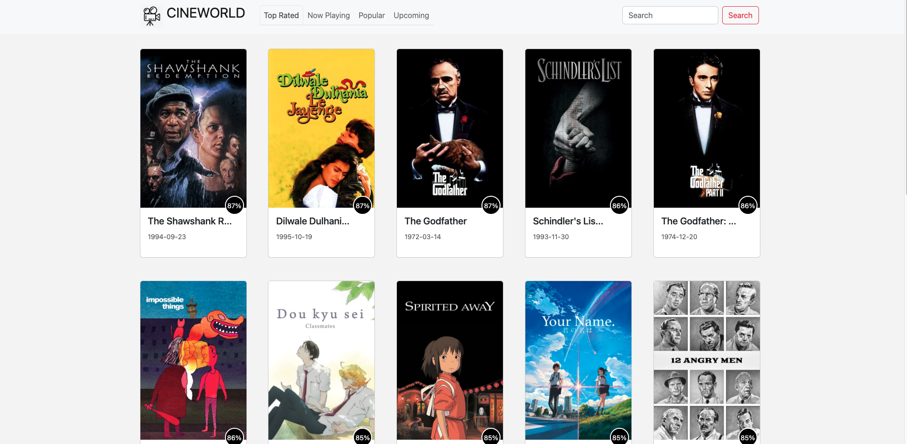
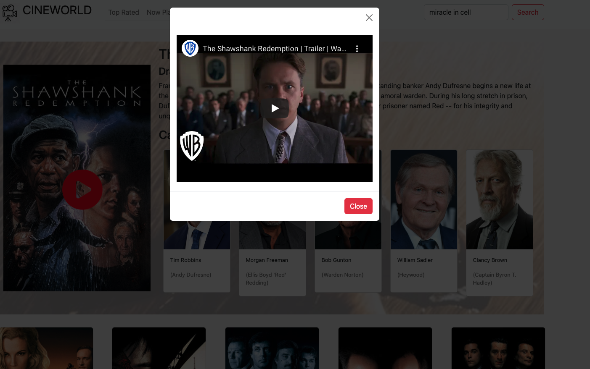

# Movie Search Project
I used [TMDB](https://www.themoviedb.org/) API for this project. In this project you can 

> 1. List Top Rated, Popular, Now Playing and Upcoming movies.
> 2. Look movie detail after clicking movie card.
> 3. Watch movie trailer in movie detail page.
> 4. Search any movie with search box.

You can try application demo from [here](https://iakancay.github.io/ProjectUsingApi/src/index.html).


## WELCOME PAGE


## MOVIE LIST PAGE


## MOVIE DETAILS PAGE


## MOVIE TRAILER MODAL


```
📦src
 ┣ 📂api
 ┃ ┣ 📜getDetails.js
 ┃ ┣ 📜getMovies.js
 ┃ ┣ 📜getSearchedMovies.js
 ┃ ┗ 📜getSimilarMovies.js
 ┣ 📂client
 ┃ ┣ 📂assets
 ┃ ┃ ┣ 📜.DS_Store
 ┃ ┃ ┣ 📜default_poster.jpeg
 ┃ ┃ ┣ 📜logo.png
 ┃ ┃ ┣ 📜movie_detail.png
 ┃ ┃ ┣ 📜top_rated.png
 ┃ ┃ ┣ 📜trailer.png
 ┃ ┃ ┣ 📜welcome.png
 ┃ ┃ ┗ 📜welcomegif.avif
 ┃ ┣ 📂components
 ┃ ┃ ┣ 📜castView.js
 ┃ ┃ ┣ 📜detailsView.js
 ┃ ┃ ┣ 📜errorView.js
 ┃ ┃ ┣ 📜movieCardView.js
 ┃ ┃ ┣ 📜navbarView.js
 ┃ ┃ ┣ 📜similarView.js
 ┃ ┃ ┣ 📜trailerModalView.js
 ┃ ┃ ┗ 📜welcomeView.js
 ┃ ┣ 📂pages
 ┃ ┃ ┣ 📜movieDetailsPage.js
 ┃ ┃ ┣ 📜movieListPage.js
 ┃ ┃ ┣ 📜searchResultsPage.js
 ┃ ┃ ┗ 📜welcomePage.js
 ┃ ┗ 📜.DS_Store
 ┣ 📜app.js
 ┣ 📜constants.js
 ┣ 📜index.html
 ┗ 📜style.css
 ```
